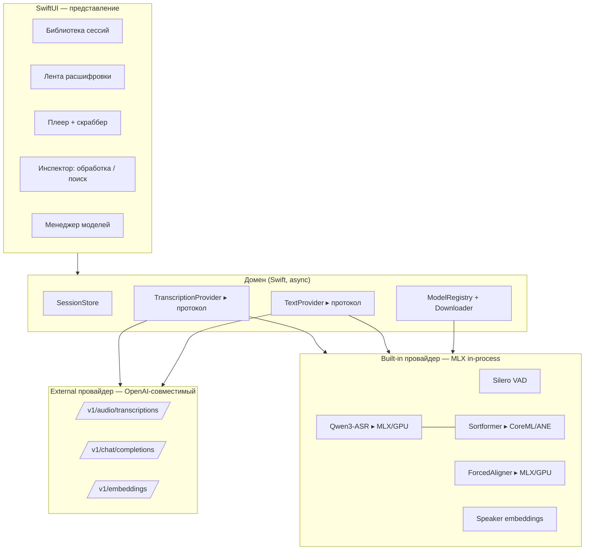
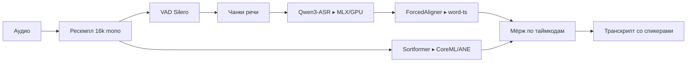

# Архитектура приложения (рабочее название «Replika»)

**Профиль:** macOS-only, Apple Silicon, нативное, оптимизировано под MLX.
**Ядро продукта:** транскрипция с диаризацией (Qwen3-ASR-1.7B по умолчанию), RU/EN и иные языки, файловый и живой режимы.

---

## 0. Ключевые решения (и почему)

| Решение | Выбор | Почему |
|---|---|---|
| Оболочка | **Нативный SwiftUI** | Mac-only, доступ к системному звуку, App Store-совместимость, нет Electron-веса |
| Компьют | **MLX (через mlx-swift)** | Нативно под Apple Silicon, unified memory, zero-copy |
| ASR + диаризация | **In-process, без Python-сайдкара** | Спавн подпроцессов запрещён песочницей → сайдкар блокирует дистрибуцию |
| Диаризация | **Sortformer на Neural Engine (CoreML)** | Освобождает GPU под ASR — GPU и ANE работают параллельно |
| Провайдеры | **Единый протокол: built-in MLX + external OpenAI** | Локальный и удалённый эндпоинты взаимозаменяемы |
| Внешний тяжёлый бэкенд | **vLLM (Linux+NVIDIA), не на Mac** | vLLM нативно на Apple Silicon не работает; это внешняя сторона |

---

## 1. Слои системы



Смысл: **UI не знает, где считается инференс.** Он говорит с `TranscriptionProvider`. Провайдеров два, оба реализуют один протокол → переключаются в настройках без изменения интерфейса.

```swift
protocol TranscriptionProvider {
    var capabilities: ProviderCaps { get }            // diarization? streaming? wordTimestamps?
    func transcribe(_ audio: AudioSource,
                    options: TranscribeOptions) -> AsyncThrowingStream<TranscriptEvent, Error>
    func cancel()
}

enum TranscriptEvent {
    case partial(Segment)      // живой режим: нестабильный префикс
    case committed(Segment)    // финализированный сегмент
    case speaker(SpeakerTag)   // метка диаризации (может прийти отдельно и смёржиться)
    case progress(Double)
    case done(Transcript)
}
```

---

## 2. UX

### Оболочка
Три зоны: слева **библиотека сессий**, по центру **лента-хребет** (спикер-спайн + монотаймкоды), снизу **плеер**, справа выдвижной **инспектор** (обработка/поиск). Плюс присутствие в **menu bar** для быстрого захвата и диктовки.

### Захват
- **Импорт:** drag-drop файла/папки, URL, батч. Форматы через встроенный декодер (AVFoundation) → 16 kHz mono.
- **Живой режим:** микрофон (AVAudioEngine) и **системный звук** через ScreenCaptureKit — захват встреч Zoom/Meet/Teams без виртуальных кабелей.

### Первый запуск
Мастер загрузки моделей: выбрать ASR (Qwen3-ASR **1.7B** — точность / **0.6B** — скорость), квантизацию (4-bit / 8-bit), диаризацию и алайнер. Показываем размер и «влезет ли» относительно unified memory.

### Работа с расшифровкой
- Правка текста прямо в реплике; **переименование спикера** пропагируется везде и в экспорт.
- **Voiceprint-энролмент:** назначил имя один раз → узнаётся между записями (эмбеддинги спикеров).
- Клик по таймкоду — перемотка; активная реплика подсвечивается по ходу; подсветка по словам (word-level).
- **Контекст-биасинг:** поле «подсказка» (имена/термины) — Qwen3-ASR принимает текстовый контекст.

### Библиотека и поиск
Сессии с метаданными (дата, спикеры, длительность, модель). Полнотекстовый поиск сразу; **семантический** — через embeddings. Экспорт: TXT / SRT / VTT / JSON / Markdown / DOCX.

### Инспектор (обработка)
Саммари / action items / перевод / чистка — через `TextProvider` (локальная MLX-LLM или внешний chat-эндпоинт вроде LM Studio).

### Пол качества
Полный офлайн по умолчанию, отсутствие телеметрии, аудио не покидает устройство (кроме явного выбора external-провайдера — с явным индикатором), keyboard-навигация, VoiceOver, reduced motion.

---

## 3. Инференс через MLX

### Пайплайн (файловый режим)



Принципы:
- **Разделение вычислителей:** ASR и алайнер — на GPU через MLX; диаризация Sortformer — на **Neural Engine** через CoreML. GPU и ANE не конкурируют, идут параллельно.
- **Unified memory:** веса и KV-кэш доступны и CPU, и GPU без копирований — MLX это эксплуатирует напрямую.
- **Формат модели без конверсии на лету:** грузим уже сконвертированные MLX-веса (см. §5), инференс без PyTorch.
- **Диаризация — отдельный шаг.** ASR отдаёт только текст; спикеры приходят от Sortformer и мёржатся по таймкодам. Это верно и для локального, и для внешнего провайдера.

### Живой режим
- Причинный/оконный энкодер Qwen3-ASR: аудио-блоки кодируются один раз, транскрипт append-only, коммитим стабильный префикс.
- **Streaming Sortformer** для диаризации на лету.
- `TranscribeEvent.partial` для нестабильного хвоста, `.committed` — когда префикс зафиксирован. Отмена и backpressure — через отмену `AsyncStream`.

### Квантизация
4-bit по умолчанию (в разы быстрее ценой небольшого роста WER), 8-bit — режим «точность». Выбор виден пользователю как «скорость ↔ точность».

### Опционально: локальный сервер
Ядро можно поднять и как **локальный OpenAI-совместимый сервер**, чтобы другие приложения использовали наш движок как STT-бэкенд. Но внутри само приложение зовёт движок **in-process** (без HTTP-оверхеда). Граница везде — протокол `TranscriptionProvider`.

---

## 4. Внешний провайдер (референс через некое API)

`RemoteOpenAIProvider` реализует тот же `TranscriptionProvider`. Контракт — OpenAI Audio API, чтобы локальный и удалённый эндпоинты были взаимозаменяемы.

### Контракт запроса
```
POST {base_url}/audio/transcriptions        (multipart)
  file=<audio>  model=<name>  language=<auto|ru|en>
  response_format=verbose_json
  timestamp_granularities[]=segment,word
Authorization: Bearer <key>   # если задан
```

### Ожидаемый ответ
```json
{
  "segments": [
    { "start": 0.4, "end": 4.2, "text": "…", "speaker": 0,
      "words": [{ "start": 0.4, "end": 0.7, "word": "…" }] }
  ]
}
```

### Требования к внешнему провайдеру (чётко прописанные)
| Поле | Обязательно | Заметка |
|---|---|---|
| `base_url` | да | напр. `http://host:8000/v1` |
| `model` | да | имя модели на сервере |
| auth | нет | Bearer, хранится в Keychain |
| `verbose_json` + сегменты | да | иначе нет таймкодов |
| `speaker` в сегментах | нет | если нет — диаризацию докидываем локально (Sortformer) и мёржим |
| железо | — | vLLM → Linux + NVIDIA + CUDA (day-0 Qwen3-ASR); LM Studio Transcribe → локально |

### Capability-проба при подключении
На «Подключить» приложение делает `GET /models` и тестовый клип: определяет, поддерживается ли `verbose_json`, word-ts, приходит ли `speaker`. Результат кладём в `ProviderCaps` → UI показывает, что доступно, и включает локальный fallback диаризации при необходимости.

---

## 5. Хранение и форматы моделей

### Расположение
`~/Library/Application Support/<App>/Models/<family>/<id>@<revision>/`
(в песочнице — контейнерный Application Support). Опционально переиспользуем общий HF-кэш.

### Форматы по типу модели
| Модель | Формат | Где считается |
|---|---|---|
| Qwen3-ASR (1.7B / 0.6B) | **MLX** — квантизированные safetensors (`mlx-community`), 4/6/8-bit | GPU (Metal) |
| Qwen3-ForcedAligner | **MLX** | GPU |
| Диаризация (Sortformer) | **CoreML** (`.mlmodelc`) | Neural Engine |
| VAD (Silero) | **CoreML** | ANE/CPU |
| Speaker embeddings (WeSpeaker/CAM++) | **CoreML** | ANE |

Логика проста: всё, что «языковое/генеративное» — MLX на GPU; всё «сигнальное/классификаторное» (VAD, диаризация, эмбеддинги голоса) — CoreML на Neural Engine.

### Реестр моделей
`registry.json` описывает каждую модель и ведёт и менеджер, и выбор провайдера:
```json
{
  "id": "qwen3-asr-1.7b",
  "family": "qwen3-asr",
  "task": "asr",
  "source": "mlx-community/Qwen3-ASR-1.7B-4bit",
  "revision": "<commit-sha>",
  "quant": "q4",
  "sizeBytes": 1180000000,
  "languages": ["ru","en","…"],
  "caps": { "wordTimestamps": true, "streaming": true, "diarization": false },
  "license": "Apache-2.0"
}
```

### Манифест артефакта (на каждую скачанную модель)
`manifest.json`: `source`, `revision` (пиним по commit hash — воспроизводимость), `quant recipe`, `sha256` каждого файла, суммарный размер, дата. Это позволяет проверять целостность и детектить апдейты.

### Загрузчик
- Источник — **Hugging Face Hub**.
- Резюмируемая передача, прогресс, отмена/докачка.
- Атомарность: качаем во временную папку → сверяем sha256 → перемещаем.
- **HF-токен** (в Keychain) для гейтед-моделей (напр. pyannote — принять условия).
- Пин ревизии; кнопка «Проверить» (пере-хеш) и «Удалить» с показом занятого места.

---

## 6. Сквозные аспекты

- **Приватность:** офлайн-first, аудио не уходит с устройства; при выборе external-провайдера — явный индикатор «данные уходят на {host}».
- **Секреты:** HF-токен и ключи внешних API — только Keychain.
- **Персистентность:** сессии и транскрипты — локально (SwiftData/GRDB-SQLite). Векторный индекс для семантического поиска — локальный (`sqlite-vec` или встроенный).
- **Производительность:** ASR на GPU, диаризация на ANE, декодирование/ресемпл на фоне; отмена по всему пути.
- **Дистрибуция:** нотаризованный DMG; путь в App Store открыт именно потому, что нет спавна подпроцессов (всё нативно, in-process).

---

## 7. Порядок сборки

1. **Каркас SwiftUI** + `TranscriptionProvider`/`TextProvider` протоколы + `RemoteOpenAIProvider` (сразу работает против vLLM/любого совместимого сервера).
2. **Менеджер моделей** + загрузчик + реестр (HF, resumable, манифест).
3. **Built-in MLX-провайдер:** VAD → Qwen3-ASR (MLX) → ForcedAligner; файловый режим.
4. **Диаризация** Sortformer (CoreML/ANE) + мёрж; voiceprint-энролмент.
5. **Живой режим** (стриминг ASR + streaming Sortformer, системный звук через ScreenCaptureKit).
6. **Инспектор** (обработка через `TextProvider`) + семантический поиск (embeddings).
7. Экспорт, полировка, нотаризация.

Границы между шагами — протоколы, так что каждый кусок тестируется отдельно, а внешний провайдер даёт рабочую транскрипцию ещё до того, как готов локальный MLX-движок.
